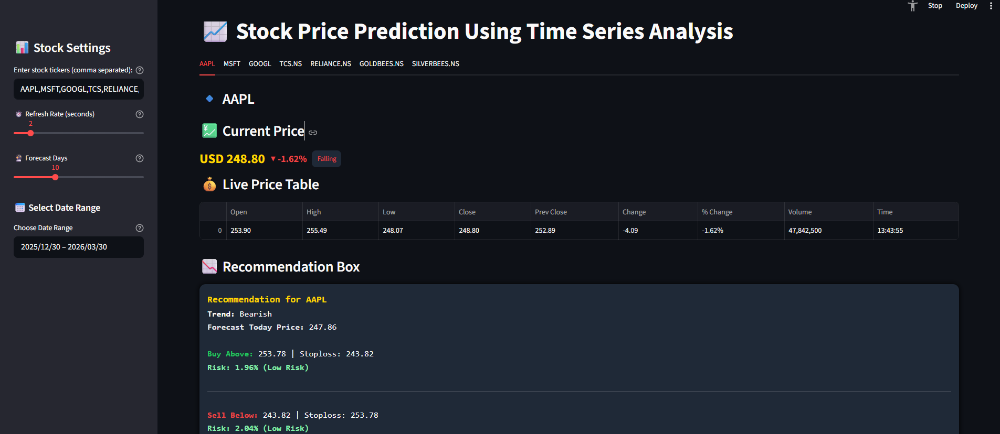
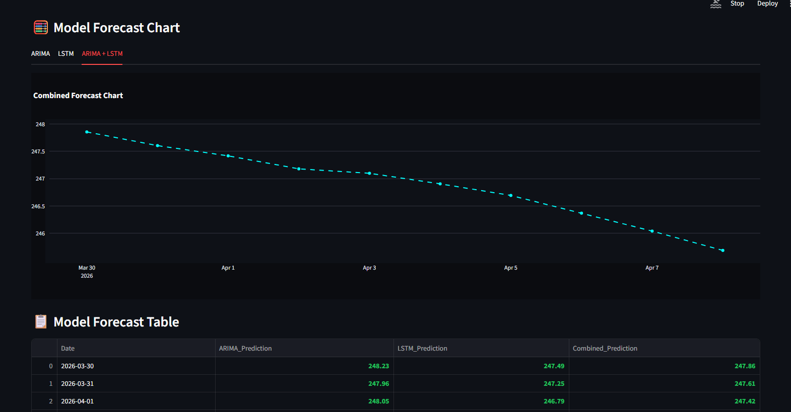

Here is your **complete, clean, and beautiful README.md** — ready to copy-paste directly into GitHub 👇

---

# 📈 Stock Price Prediction Dashboard

A powerful and interactive **Stock Price Prediction Web App** built with **Streamlit**, combining **Time Series Analysis (ARIMA)** and **Deep Learning (LSTM)** to forecast stock prices.

This dashboard provides **real-time stock data, historical insights, predictions, and trading recommendations** — all in one place.

---

## 🚀 Features

* 📊 Live Stock Prices (Auto Refresh)
* 📈 Interactive Historical Charts (Zoom + Range Slider)
* 🔮 Forecasting using:

  * ARIMA (Statistical Model)
  * LSTM (Deep Learning Model)
  * Combined Prediction
* 📉 Buy/Sell Recommendation Engine
* 📋 Styled Data Tables (Live + Historical)
* ⚡ Real-Time Updates with Custom Refresh Rate
* 🌍 Supports:

  * US Stocks (AAPL, TSLA, etc.)
  * Indian Stocks (TCS, RELIANCE, etc.)
  * Commodities (Gold, Silver ETFs)

---

## 🖼️ Dashboard Preview

### 📊 Main Dashboard



### 🔮 Forecast & Predictions



---

## 🏗️ Project Structure

```
stock-price-prediction/
│
├── stock_price.py        # Main Streamlit Application
├── requirements.txt      # Python dependencies
├── README.md             # Documentation
│
├── assets/               # Images used in README
│   ├── dashboard.png
│   └── forecast.png
│
└── .venv/ (optional)     # Virtual environment
```

---

## ⚙️ Installation & Setup

### 1️⃣ Clone the Repository

```bash
git clone https://github.com/your-username/stock-price-prediction.git
cd stock-price-prediction
```

---

### 2️⃣ Create Virtual Environment

```bash
python -m venv .venv
```

Activate it:

```bash
.\.venv\Scripts\Activate.ps1   # Windows PowerShell
```

---

### 3️⃣ Install Dependencies

```bash
pip install -r requirements.txt
```

---

### 4️⃣ Run the Application

```bash
streamlit run stock_price.py
```

---

## 📦 Requirements

```
streamlit
pandas
yfinance
plotly
requests
numpy
statsmodels
tensorflow
scikit-learn
matplotlib
openpyxl

# Optional
tqdm
keras
```

---

## 🔑 API Setup (Optional but Recommended)

This app supports **Finnhub API** for better live stock data.

### Steps:

1. Get your API key from: [https://finnhub.io](https://finnhub.io)
2. Set environment variable:

```bash
set FINNHUB_API_KEY=your_api_key   # Windows
```

---

## 🧠 Models Used

### 📌 ARIMA (AutoRegressive Integrated Moving Average)

* Classical time series model
* Works well for short-term trends

### 📌 LSTM (Long Short-Term Memory)

* Deep learning model for sequence prediction
* Captures long-term dependencies in stock data

### 🔗 Combined Prediction

* Average of ARIMA + LSTM
* Improves prediction stability

---

## 📊 Key Functionalities

* Multi-stock analysis (comma-separated input)
* Dynamic refresh rate control
* Date range filtering
* Forecast visualization
* Model performance metrics:
* RMSE (Root Mean Squared Error)
* MAE (Mean Absolute Error)
* Fallback system (synthetic data if API fails)

---

## 🛠️ Tech Stack

* **Frontend/UI:** Streamlit
* **Visualization:** Plotly
* **Data Source:** Yahoo Finance (yfinance) + Finnhub API
* **Machine Learning:**
* Statsmodels (ARIMA)
* TensorFlow / Keras (LSTM)
* **Data Processing:** Pandas, NumPy

---

## 🧹 Remove Virtual Environment

```bash
Remove-Item -Recurse -Force .venv
```

---

## 💡 Future Improvements

* Add more ML models (Prophet, XGBoost)
* Portfolio tracking dashboard
* Email/SMS stock alerts
* Cloud deployment (Streamlit Cloud / AWS)
* User authentication

---

## 👨‍💻 Author

**Sujith**

---

## ⭐ Support

If you like this project:

* ⭐ Star this repository
* 🍴 Fork it
* 📢 Share it

---

## 📌 Notes

* Ensure Python version **3.10 / 3.11**
* Internet connection required for live data
* Finnhub API improves real-time accuracy

---

